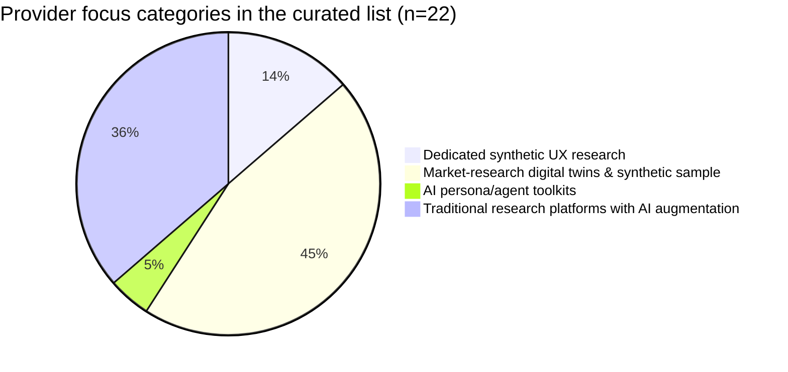
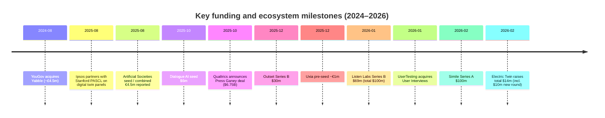

# Synthetic User Research Tools and the Provider Ecosystem

## Executive summary

Synthetic user research is no longer a single “thing.” In practice, the market has split into four overlapping segments: (a) dedicated synthetic UX research (simulate users against product flows), (b) market-research “digital twins” and synthetic sample providers (simulate consumer / stakeholder responses), (c) AI persona/agent toolkits (build-your-own synthetic panels), and (d) traditional research platforms adding AI to speed recruiting, moderation, and synthesis. citeturn14search10turn15search0turn21search0

From 2025 through early 2026, funding and product momentum accelerated most visibly in two places:

First, AI-moderated research platforms (which still recruit real humans, but automate interviewing/synthesis) raised large rounds and broadened into end-to-end “continuous listening” products—e.g., a $69M Series B for Listen Labs and a $30M Series B for Outset. citeturn15search0turn15search7turn16search24

Second, the “synthetic audiences / digital twins” segment produced both new venture-scale entrants (e.g., Electric Twin’s $14M raise; Artificial Societies’ seed) and very large financings for “high‑fidelity digital twins” platforms (e.g., Simile’s $100M Series A). citeturn5search0turn4search2turn6search21

At the same time, consolidation is beginning to show up: YouGov acquired Yabble (a synthetic insights company) in 2024, and UserTesting acquired User Interviews in January 2026 to combine insight workflows with participant access (including use cases like AI training). citeturn4search15turn17search2

The central analytical takeaway: most products are converging toward “hybrid research stacks,” where synthetic outputs are used for rapid iteration and hypothesis testing, then validated (selectively) with real respondents. This is not just an opinionated best practice—it is strongly implied by major incumbents’ stated “HI + AI” positioning and by the academic literature’s warnings that LLM-driven “digital twins” often underperform for individual-level prediction and can be sensitive to prompting/measurement choices. citeturn21search2turn21academia40turn8search25

## Provider landscape and curated directory

A useful baseline definition comes from NN/g: a “synthetic user” is an AI-generated profile intended to mimic a user group, producing research findings without studying real users directly. citeturn14search10 In the ecosystem, however, many vendors position “synthetic” as *data-grounded simulation* (e.g., census/panel-conditioned populations; “digital twin panels”), while others focus on *AI-led interviewing or synthesis* of real participants. citeturn21search0turn6search8turn16search24turn13search1

### Curated list of startups and platforms

“Unspecified” indicates the item was not found in public/primary sources during this review, or was not clearly stated by the company.

| Name | URL | HQ location | Founded | Latest funding round and amount (public) | Stage | Category focus | Core product features (concise) | Primary use cases | Notable customers/partners (public) |
|---|---:|---|---:|---|---|---|---|---|---|
| entity["company","Synthetic Users","ai personas user research"] | `https://www.syntheticusers.com/` | entity["city","Los Angeles","California, US"] citeturn9view2 | unspecified | unspecified | unspecified | Dedicated synthetic UX research | Synthetic participants for interviews + surveys; multi‑agent LLM architecture; RAG-based “enrichment” with proprietary/customer data. citeturn9view0turn9view2turn9view1 | Need/pain discovery, concept + messaging testing, continuous insight. citeturn9view0turn9view1 | Partner/program: entity["organization","Comcast NBCUniversal LIFT Labs","startup accelerator"]. citeturn9view1 |
| entity["company","Uxia","synthetic ux testing tool"] | `https://uxia.app/` | entity["city","Barcelona","Catalonia, ES"] citeturn1search17turn1search33 | unspecified | Pre‑seed ≈€1M (Dec 2025). citeturn1search17 | Pre‑seed | Dedicated synthetic UX research | “Synthetic users” to test prototypes/flows and surface usability + accessibility issues (vendor positioning). citeturn1search33turn1search17 | Rapid pre‑test of UX flows (esp. early design). citeturn1search33 | unspecified |
| entity["company","Blok","virtual users product simulation"] | `https://www.joinblok.co/` | entity["city","San Francisco","California, US"] citeturn12search12turn11view0 | 2024 citeturn12search15 | Seed $7.5M (Jul 2025). citeturn11view0 | Seed | Dedicated synthetic UX research | Simulation environment that generates AI “virtual users modeled off actual product behavior” to stress-test onboarding/flows and compare variants pre-launch. citeturn11view0turn12search0 | Predict friction & conversion lift; pre‑launch experimentation; persona-specific flow testing. citeturn11view0 | unspecified |
| entity["company","Electric Twin","synthetic audiences platform"] | `https://www.electrictwin.com/` | entity["city","London","England, UK"] citeturn5search32turn5search0 | 2023 citeturn5search4 | Total $14M; new $10M round (Feb 2026) + prior $4M pre‑seed. citeturn5search0turn5search5 | Series A (company framing) citeturn5search0turn5search15 | Market-research digital twins & synthetic sample | “Synthetic audiences” combining LLMs + social science research + ML; positioned for fast prediction of audience response; claims of speed/accuracy vs traditional research (vendor-claimed; treat as marketing). citeturn5search0turn5search12turn5search5 | Message/campaign testing, product idea testing, targeting and geo expansion, sensitive-content testing. citeturn5search1 | Investors/partner signal: entity["company","Atomico","venture capital firm"] led the round. citeturn5search5turn5search0 |
| entity["company","Simile","high-fidelity digital twins"] | `https://simile.ai/` | entity["city","Palo Alto","California, US"] citeturn6search2 | 2025 citeturn6search2 | Series A $100M (Feb 2026). citeturn6search21turn2search2 | Series A | Market-research digital twins & synthetic sample | Digital twins built with real people; orchestrated to answer what people will do and why (positioned as decision-making infrastructure). citeturn6search21turn2search2 | Enterprise decision simulation; scenario planning and forecasting. citeturn6search21 | Lead investor: entity["company","Index Ventures","venture capital firm"]. citeturn6search21 |
| entity["company","Artificial Societies","ai social simulations"] | `https://societies.io/` | London citeturn10search12 | 2024 citeturn10search12turn10search26 | Seed €2.8M (Aug 2025); €4.5M combined pre‑seed+seed reported. citeturn4search2 | Seed | Market-research digital twins & synthetic sample | Networks of AI personas that simulate societal dynamics (how groups respond to surveys/info). citeturn10search26turn10search12 | Predict stakeholder response to comms, marketing content, “idea spread” in social systems. citeturn10search26turn10search13 | Accelerator/partner signal: entity["organization","Y Combinator","startup accelerator"] backing noted. citeturn10search12turn10search26 |
| entity["company","Panoplai","enterprise digital twins for research"] | `https://www.panoplai.com/` | entity["city","Brooklyn","New York, US"] citeturn10search33turn19search17 | 2021 (founded as “Glimpse,” later rebrand). citeturn10search23turn10search10 | Funding reported as $1.4M (database listing); otherwise unspecified. citeturn19search0turn19search7 | unspecified | Market-research digital twins & synthetic sample | Digital twins of customer/segment built from real research + customer data; chat interface; synthetic data/digital twin governance framing (incl. ESOMAR “20 Questions” response). citeturn5search29turn5search25turn5search17 | Market research & innovation cycles; enterprise “insights memory” + simulation-based Q&A. citeturn10search10turn5search29 | Public example brands claimed in company content (treat as self-asserted): entity["company","The Kraft Heinz Company","food company"] (example mention). citeturn5search13 |
| entity["organization","Ipsos","market research firm"] | `https://www.ipsos.com/` | entity["city","Paris","France"] (corporate base; global operations) citeturn21search3turn21search0 | unspecified | N/A (public company; funding not the primary signal) | Public company | Market-research digital twins & synthetic sample | “Digital twin panels” / synthetic respondents strategy; explicit “HI + AI” positioning; PersonaBots for conversational segment exploration (product family). citeturn21search0turn21search2turn21search4 | Faster market & public opinion research; synthetic panels for augmentation and (selective) replacement of some data collection. citeturn21search2turn21search0 | Partner: entity["organization","Stanford University","university in california"] (PASCL) for building/validating digital twin panels. citeturn21search0turn21search1 |
| entity["company","Toluna","consumer insights company"] | `https://tolunacorporate.com/` | unspecified | unspecified | N/A (not primarily disclosed) | Established vendor | Market-research digital twins & synthetic sample | Synthetic Personas product: “1 million” personas; expanded markets/languages; positioned for fast scale testing. citeturn5search3turn5search7turn5search18 | Claims/idea testing, ad/creative testing, product feature and message screening. citeturn5search7turn5search38 | unspecified |
| entity["organization","Bellomy","market research company"] | `https://www.bellomy.com/` | unspecified | unspecified | unspecified | Established vendor | Market-research digital twins & synthetic sample | “Synthetic respondents” generated using existing human data; frames multiple synthetic approaches (pure synthetics, digital twinning, scenario synths) and recommends hybrid use. citeturn10search3turn10search7turn10search24 | Faster survey-like insights and scenario testing; extending value of hard-to-reach data. citeturn10search3turn10search11 | unspecified |
| entity["company","Ditto","synthetic market research platform"] | `https://askditto.io/` | entity["city","Toronto","Ontario, CA"] citeturn7search2turn7search0 | 2025 citeturn7search2 | unspecified | Early-stage | Market-research digital twins & synthetic sample | “Population-true synthetic persona panels” positioned as census-grounded; multi-country persona libraries; API/MCP + Slack + web UX; publishes calibration methodology (e.g., census microdata + raking). citeturn6search8turn6search4turn7search0 | Concept/messaging/pricing tests; rapid segmentation and scenario exploration. citeturn6search8 | Example use case shown in a public case study: ESPN DTC pricing/adoption simulation (case study framing). citeturn6search29 |
| entity["company","Yabble","generative ai insights company"] (acquired) | `https://www.yabble.com/` | entity["city","Auckland","New Zealand"] citeturn4search11turn4search19 | 2017 (company claim) citeturn4search19 | Acquisition by entity["company","YouGov","international data analytics group"] for ~£4.5m (Aug 2024). citeturn4search15turn4search7 | Acquired | Market-research digital twins & synthetic sample | GenAI-driven insights; “Virtual Audiences”/AI personas used for concept/creative testing (as described in trade press). citeturn4search27turn4search15 | Creative testing, concept testing, scenario forecasting (trade descriptions). citeturn4search27turn4search15 | Partner/data integration implied by acquisition (YouGov data foundation for Yabble AI platform). citeturn4search7turn4search15 |
| entity["company","Delve AI","ai persona generator"] | `https://delve.ai/` | San Francisco (address published) citeturn2search12 | 2019 (LinkedIn listing) citeturn2search0 | unspecified | unspecified | Market-research digital twins & synthetic sample | AI personas/digital twins generator and “persona-based user research” positioning; includes synthetic research/segmentation tooling in product taxonomy. citeturn2search12turn2search1 | Personas, segmentation, campaign and product planning with simulated audiences. citeturn2search1 | unspecified |
| entity["company","Relevance AI","ai agent platform"] | `https://relevanceai.com/` | unspecified | unspecified | unspecified | Private company | AI persona/agent toolkits | Template for “synthetic user research” that generates tabular responses from 25 synthetic participants given survey questions/context/traits. citeturn14search0turn14search7 | Rapid exploratory feedback simulation when real survey fielding is constrained. citeturn14search0 | unspecified |
| entity["company","Listen Labs","ai-first customer research platform"] | `https://listenlabs.ai/` | San Francisco citeturn15search0turn14search13 | unspecified | Series B $69M (Jan 2026); total funding $100M stated. citeturn15search0turn15search3 | Series B | Traditional research platforms with AI augmentation | AI interviewer + automated study creation, recruitment from “30 million” participants, rapid synthesis & exec-ready outputs (vendor claims). citeturn15search0turn15search15 | Messaging, product concepts, usability tests (human interviews at scale, AI-run). citeturn15search0turn14search2 | Public customer examples in coverage: entity["company","Microsoft","technology company"] and entity["company","Sweetgreen","restaurant chain"]. citeturn15search24 |
| entity["company","Outset","ai-moderated research platform"] | `https://outset.ai/` | San Francisco citeturn16search24turn15search7 | 2022 citeturn16search24 | Series B $30M (Dec 2025); total funding $51M stated. citeturn15search7turn15search1 | Series B | Traditional research platforms with AI augmentation | LLM-led interviews + synthesis; multi‑modal (video/audio/text); positioned as “depth of an interview, scale of a survey.” citeturn16search24turn15search7 | Qual/UX research at scale, concept and usability testing with real respondents. citeturn16search24turn16search1 | Public customer examples on company materials/press: entity["company","WeightWatchers","consumer health company"]. citeturn15search4 |
| entity["company","ResearchGOAT","ai qualitative research platform"] | `https://researchgoat.com/` | entity["city","Atlanta","Georgia, US"] citeturn16search7turn15search5 | 2023 citeturn16search7 | unspecified | Early-stage (public funding unclear) | Traditional research platforms with AI augmentation | AI moderators + recruitment workflow + multi-respondent live interviewing; described pricing: free minutes then usage-based. citeturn15search5turn15search14turn16search7 | Rapid qual fielding across languages/geographies (vendor positioning). citeturn15search5turn15search8 | Pricing detail publicized via entity["company","User Interviews","participant recruitment platform"] blog list ($1/min after free tier). citeturn15search14 |
| entity["company","Dialogue AI","ai-native market research"] | `https://www.dialogueai.com/` | entity["city","Los Angeles","California, US"] citeturn4search28turn4search4 | unspecified | Seed $6M (Oct 2025). citeturn4search4turn4search1 | Seed | Traditional research platforms with AI augmentation | Automates research lifecycle (study design → recruiting → AI-led interviewing → synthesis/reporting). citeturn4search5turn4search4 | Fast customer/market research for product and marketing teams. citeturn4search1turn4search5 | Public customer examples in reporting: entity["company","Nextdoor","social networking company"]. citeturn19news31 |
| entity["company","Maze","user research platform"] | `https://maze.co/` | entity["city","Paris","France"] citeturn18search1turn18search0 | unspecified | Series B $40M (Jun 2022). citeturn18search0turn18search1 | Series B | Traditional research platforms with AI augmentation | Research platform “powered by AI;” includes AI-assisted recruiting/moderation/summarization positioning and AI follow-up tools. citeturn13search0turn13search4turn13search15 | Product research & testing at scale (prototype tests, surveys, moderated/unmoderated research). citeturn13search0 | Strategic investors noted in Series B announcement (e.g., Atlassian/Zoom/HubSpot venture arms). citeturn18search0 |
| entity["company","Dovetail","customer research platform"] | `https://dovetail.com/` | entity["city","Sydney","New South Wales, AU"] citeturn18search25turn18search5 | 2017 citeturn18search25 | Series A $63M (Jan 2022). citeturn18search5turn18search3 | Series A | Traditional research platforms with AI augmentation | Insight repository + AI analysis (Q&A over data, transcription, summaries); docs note Claude-powered chat and multi-provider transcription. citeturn13search6turn13search2 | Centralize and synthesize customer feedback (calls, tickets, surveys) for product/UX teams. citeturn13search2turn13search6 | Public customer logos include entity["company","Shopify","e-commerce company"]. citeturn13search2 |
| entity["company","UserTesting","customer insights platform"] | `https://www.usertesting.com/` | Bellevue citeturn17search2turn13search8 | unspecified | Acquired entity["company","User Interviews","participant recruitment platform"] (Jan 2026). citeturn17search2turn17search14 | Private equity-owned (portfolio) | Traditional research platforms with AI augmentation | Human insight platform + AI for summarization/theme extraction from video/audio/text/behavioral data; emphasizes proprietary+open model mix and “behavioral transcripts.” citeturn13search1turn13search5turn17search2 | Real-user testing + faster synthesis; tighter integration into design workflows. citeturn13search1turn13search16 | Parent/owner signal: entity["company","Thoma Bravo","private equity firm"] (portfolio page). citeturn17search18 |
| entity["company","Qualtrics","experience management platform"] | `https://www.qualtrics.com/` | Provo + Seattle (public filings / company history). citeturn17search15turn17search27 | 2002 citeturn17search15 | Taken private by entity["company","Silver Lake","private equity firm"] + CPP (Jun 2023); later announced Press Ganey deal $6.75B (Oct 2025). citeturn17search27turn17search7 | Private equity-owned | Traditional research platforms with AI augmentation | “Qualtrics AI” features: conversational feedback, adaptive follow-ups, and large-scale text analytics narratives (XM). citeturn13search3turn13search10turn13search25 | Enterprise CX/EX/strategy research at scale; augment surveys and feedback programs. citeturn13search3turn13search25 | M&A: Press Ganey Forsta acquisition announced at $6.75B. citeturn17search7turn17news40 |

## Ecosystem mapping

The ecosystem is best understood as a convergence of three forces: (1) venture-backed “agentic workflows” replacing labor-intensive research steps, (2) synthetic/digital-twin methods seeking to compress or partially replace data collection, and (3) incumbents expanding proprietary datasets and distribution, including through M&A. citeturn15search0turn21search2turn17search7

### Funding trends and capital formation patterns

The distribution of funding sizes in this niche is notably bimodal: (a) early-stage rounds supporting productization of AI-moderated research or synthetic-audience pilots (mid single-digit millions to low tens), and (b) occasional “infrastructure-scale” financings for digital twin platforms positioned as enterprise decision infrastructure (e.g., $100M Series A). citeturn4search4turn5search0turn6search21

In AI overall, Crunchbase reported that “foundation model” companies captured a large share of 2025 investment dollars, underscoring that many synthetic-research providers are “application-layer” companies building on rapidly improving base models rather than building their own foundational models. citeturn19search14

### Geographic clusters

Based on HQ disclosures in public sources and funding announcements in the curated list, three clusters stand out:

San Francisco Bay Area remains the densest concentration for AI research tooling and “agentic workflow” startups across both synthetic and AI-moderated approaches (e.g., Outset, Listen Labs, Blok). citeturn16search24turn15search0turn11view0

London is the clearest European hub for venture-backed “synthetic audiences” and simulation-first approaches (e.g., Electric Twin; Artificial Societies reported as London-based). citeturn5search0turn10search12turn4search2

A third pattern is “regional specialization plus global selling,” including Toronto-based Ditto (explicitly publishing a Toronto HQ address) and Barcelona-based Uxia. citeturn7search0turn7search2turn1search17

### Typical business models and pricing

Across the ecosystem, pricing tends to map to “what is being replaced.”

Interview-minute or interview-count pricing is common where the product replaces moderated interview labor. ResearchGOAT is described as offering a limited free tier and then per-minute billing by a third-party industry list, while Synthetic Users is described as enterprise-ready and “priced per interview” in a directory listing. citeturn15search14turn9view2

Enterprise subscriptions show up most clearly in incumbent or platform-style offerings (e.g., Qualtrics AI embedded into the XM platform; Dovetail’s AI features inside a repository model). citeturn13search3turn13search6turn18search5

Usage-based “simulation” pricing is often implied (rather than clearly posted) in synthetic-audience startups; Electric Twin’s public materials emphasize rapid, repeated testing across many evaluations, consistent with a credit/usage model even when explicit pricing is not posted. citeturn5search1turn5search0

### Common technical approaches

In public statements and product descriptions, four repeatable technical patterns appear.

Multi-agent LLM architectures plus retrieval augmentation are a dominant pattern in synthetic participant products that aim to produce interview-like outputs with follow-up probing and customization. citeturn9view2turn9view0

Data-grounded persona generation—often via census, survey microdata, or first-party panel data—appears as a key credibility wedge for synthetic respondents. Ditto explicitly claims census grounding and publishes calibration language, while Ipsos frames “quality synthetic data cannot exist without quality human data,” and positions digital twin panels as virtual representations of real respondents. citeturn6search4turn21search2turn21search1

AI-led interviewing of real participants (not “synthetic users”) is a distinct stack: LLMs moderate interviews, then compute structured insight outputs. Outset and Listen Labs both explicitly position LLMs as interviewers with rapid synthesis. citeturn16search24turn15search0turn15search7

Social simulation / network effects are treated as a differentiator by “society simulation” products (Artificial Societies), which emphasize groups of interacting personas versus isolated respondent simulations. citeturn10search26turn10search12

## Risks, limitations, and recommended use cases

This space has unusually high “epistemic risk” for buyers: the outputs can look convincing even when the measurement properties are weak, and the gap between marketing claims and validated performance can be large. citeturn14search10turn21academia40turn8search7

### What can go wrong

Representativeness and “population truth” are not guaranteed by default. The Max Planck/NeurIPS paper “Questioning the Survey Responses of Large Language Models” systematically compares LLM survey responses to the U.S. American Community Survey and questions whether these responses faithfully represent any human population without careful validation. citeturn8search3turn8search7

Individual-level digital twins remain unreliable in many settings. A 2025 arXiv mega-study of LLM-powered digital twins reports modest average correlation between twin and human answers and warns that twin responses can be less variable than human responses—meaning they may understate disagreement, tails, and edge cases. citeturn21academia40

Prompting and measurement artifacts can be severe. A 2025 PLOS One paper on “prompt architecture” shows that seemingly arbitrary prompt framing/order choices can induce methodological artifacts and statistical bias across models. citeturn8search25

Fraud and manipulation risks cut both ways. On one hand, vendors promote synthetic respondents as a way to avoid recruitment barriers; on the other, research on “autonomous synthetic respondents” shows that LLM-based tools can evade attention checks at very high rates, raising the threat that malicious actors can corrupt online surveys and polling ecosystems. citeturn8search30turn8search10

### Recommended (defensible) use cases

A practical, defensible framing is: use synthetic methods for **speed and breadth** early, and reserve human research for **ground truth and nuance** when the decision is expensive, regulated, or irreversible.

Good fits include rapid iteration on interview guides before fielding with people (a “test the test” use case), early-stage concept screening, exploring plausible segmentation hypotheses, and scenario planning where you explicitly treat outputs as “directional.” This aligns with both industry guidance on synthetic users and the way incumbents frame synthetic data as augmentation rather than full replacement. citeturn14search10turn10search24turn21search2

Higher-risk fits include executive decisions that require accurate population estimates, individual-level predictions (e.g., “what *this specific customer* will do”), and sensitive domains where model bias or lack of lived experience can mislead. The academic evidence on representativeness, digital twins, and prompt sensitivity makes these use cases particularly risky without rigorous validation and documentation. citeturn21academia40turn8search7turn8search25

## Competitive landscape and near-term evolution

Two competitive dynamics define the landscape: “validation and trust” versus “distribution and workflow lock-in.”

Validation and trust: incumbents and some startups are increasingly emphasizing scientific validation frameworks and explicit limitations. Ipsos’ public materials repeatedly emphasize transparency/truth/trust and partnership-based validation with Stanford; Panoplai publishes governance-related responses to ESOMAR’s “20 Questions.” citeturn21search2turn21search0turn5search25

Distribution and workflow lock-in: traditional platforms are racing to embed AI into the research stack and, crucially, to own high-quality participant access and proprietary datasets. UserTesting’s acquisition of User Interviews is a concrete example of the distribution thesis. Qualtrics’ $6.75B Press Ganey deal (announced) is an example of the “proprietary dataset moat” logic becoming central in experience/insights platforms. citeturn17search2turn17search7turn17news40

### Comparison table of category-level competition

| Category | Primary “unit of value” | Strengths | Common failure modes | Best buyer wedge | Representative providers from the list |
|---|---|---|---|---|---|
| Dedicated synthetic UX research | Simulated tasks/flows | Shift-left UX feedback; fast iteration before human recruiting; can stress-test many variants. citeturn11view0turn9view0 | Overconfidence in realism; weak discovery of novel needs; limited emotion/context. citeturn14search10turn21academia40 | Design/product teams trying to reduce iteration latency | Synthetic Users; Uxia; Blok citeturn9view0turn1search33turn11view0 |
| Market-research digital twins & synthetic sample | Synthetic respondent “panels” / audience sims | Fast testing of messaging, claims, segments; potential scale across geos; can be conditioned on prior data/panels. citeturn5search0turn21search2turn5search7 | Representativeness gaps; prompt artifacts; weak individual prediction; bias toward training distributions. citeturn8search7turn8search25turn21academia40 | Insights orgs seeking speed without giving up methodological governance | Electric Twin; Ipsos; Toluna; Panoplai; Simile; Artificial Societies citeturn5search0turn21search0turn5search7turn5search29turn6search21turn10search26 |
| AI persona/agent toolkits | DIY synthetic tables/agents | Low friction, controlled inputs, customizable; good for internal ideation/ops. citeturn14search0turn14search7 | Easy to create “plausible nonsense”; difficult to validate; may be misused as evidence. citeturn14search10turn8search25 | Ops/PMM teams needing lightweight exploration without procurement | Relevance AI citeturn14search0 |
| Traditional research platforms with AI augmentation | Faster human research + faster synthesis | Keeps real respondents; AI compresses time-to-insight; integrates into existing workflows and data pipelines. citeturn15search0turn16search24turn13search1 | Risk of automation bias in synthesis; data governance/privacy responsibilities; “AI moderator” still misses nuance. citeturn13search13turn8search25turn14search20 | Research ops and enterprise UX orgs seeking throughput + governance | Listen Labs; Outset; Dialogue AI; Maze; Dovetail; UserTesting; Qualtrics citeturn15search0turn15search7turn4search4turn13search0turn13search6turn13search1turn13search3 |

### Likely evolution over the next 12–24 months

Hybridization becomes the default product design. The most defensible near-term product direction is “synthetic + human mixing,” with vendors explicitly using synthetic outputs to narrow hypotheses and then validating with smaller, higher-quality human samples—mirroring the “HI + AI” stance and hybrid guidance from incumbents and research firms. citeturn21search2turn10search24turn10search11

Validation frameworks, audit trails, and standards alignment become competitive differentiators. Buyers will increasingly ask “how do you know this is right?”; companies already publishing governance responses (e.g., ESOMAR-style disclosures) are signaling where procurement expectations are heading. citeturn5search25turn21search1turn21search2

Distribution consolidates around panels, proprietary datasets, and design/workflow integrations. The logic behind UserTesting + User Interviews—and the broader push toward “insights in the tools where work happens” (e.g., Figma integrations)—suggests more acquisitions and plugins as competitive weapons. citeturn17search2turn13search16turn13search11

## Investor and PM briefing

The market opportunity is real, but the wedge is not “replace research.” The wedge is “collapse iteration time while preserving enough rigor that stakeholders trust outcomes.”

### What’s happening in one page

A large part of the market research / customer insights process is workflow cost (recruiting, scheduling, moderation, transcription, synthesis). AI-moderated platforms attack this by keeping real participants but automating everything else—funding rounds and product positioning explicitly emphasize this idea. citeturn15search0turn15search7turn4search4

Synthetic audiences/digital twins attack a different bottleneck: they try to partially replace fielding by simulating populations, often claiming grounding in survey/panel data. Incumbents are investing here too, but their language is cautious and validation-heavy, implying that “trust” is the main constraint on adoption. citeturn21search2turn21search0turn21search7

Academic evidence is simultaneously enabling and constraining: it supports the plausibility of “silicon samples” in some contexts, but it also shows modest correlations and sensitivity to prompting and representativeness—meaning vendor differentiation will increasingly come from evaluation and domain constraints, not from generic LLM prompting. citeturn8search0turn21academia40turn8search25

### Competitive opportunities and GTM wedges

Shift-left product decisions: sell synthetic UX simulation as a “linting layer” for product flows before spending on A/B tests or large-scale recruitment. This is exactly how Blok positions itself—simulate and compare flows before launch. citeturn11view0

Enterprise “synthetic sample governance” layer: a major whitespace is tooling that helps enterprises document how synthetic results were generated, validated, and bounded (“where it works / doesn’t”), mapping to procurement needs and standards checklists (ESOMAR-style). Panoplai and Ipsos are already signaling this direction. citeturn5search25turn21search2

Panel + workflow integration as a moat: own or tightly partner for respondent access, and integrate into daily tools. UserTesting’s acquisition of User Interviews is a strong market signal that distribution is becoming a first-class moat in insights tooling. citeturn17search2turn17search14

Verticalized twins: the academic literature suggests generic “one model fits all” twins are brittle; vertical constraints (domain ontologies, controlled stimulus libraries, validated benchmarks) are a plausible path to higher trust and conversion. This is compatible with Ipsos’ emphasis on context, ethics, and validation pillars. citeturn21search2turn21search21turn21academia40

### Product and diligence checklist for buyers and investors

Evidence of validity: look for published benchmarking against held-out human data, not just “face validity.” The emerging academic consensus is that naive approaches can mislead, and individual-level prediction is particularly weak. citeturn21academia40turn8search7

Robustness to prompt variation: require a methodology that tests sensitivity to question framing and prompt structure. Prompt architecture can materially change outputs. citeturn8search25

Disclosure and governance: prefer vendors that document limitations and align with research governance frameworks; incumbents are explicitly framing synthetic data in terms of trust/transparency. citeturn21search2turn5search25

Risk controls: watch for misuse potential (poll/data manipulation; synthetic respondent contamination). This is both a societal risk and a product requirement for clients in regulated or reputationally sensitive contexts. citeturn8search30turn8search10